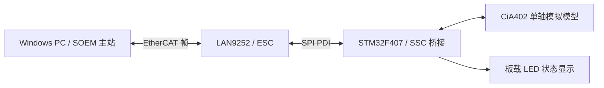

# STM32F407 + LAN9252 EtherCAT 单轴模拟关节

基于元杞科技 EtherCAT 从站开发板 V3，使用 **STM32F407ZET6 + LAN9252、CMake/GNU Arm、ST-LINK/OpenOCD/GDB 和 Windows SOEM 主站**，完成真实 EtherCAT 通信与 CiA402 单轴模拟关节演示。

主站下发位置或速度目标，板端更新关节模型并返回状态、位置和速度；五个板载 LED 显示通信、使能、运动方向与故障。位置使用教学计数，当前没有接入真实电机。

**已有实测：**发现 1 个从站、SDO 与映射检查通过、进入 OP、双向 PDO 各 12 字节；三轮快速演示累计 627 次有效 PDO 交换，WKC 均为 3。请求周期为 10ms，属于短测。出厂 Flash/SII 已备份，EEPROM 未改写。

## 已实现内容

- 基于商家 SSC 5.11 与 SPI PDI 驱动集成 LAN9252 从站，保留出厂 EEPROM 配置。
- 使用 SOEM 发现从站，读取 CoE/SDO 身份及 PDO 映射，核对配置后进入 OP。
- 显式小端编解码 12 字节命令与反馈，板端通过命令快照接入应用模型。
- CiA402 教学子集：使能、CSP 位置模式、CSV 速度模式、快速停止、故障锁存及显式复位。
- 主站按反馈推进演示阶段，记录 WKC、位置/速度及 PC 侧调用时间。
- 板端应用超时处理与 LED 状态显示，电脑端行为测试及主站序列模拟测试。
- CMake 固件/主站构建，GNU 启动与链接适配，ST-LINK 烧录及 GDB 变量观察。

## 系统结构



LAN9252 处理 EtherCAT 帧与过程数据区；STM32 通过 SPI 读写 ESC，再将命令交给模型。ST-LINK 使用 SWD 下载和调试，与 EtherCAT 网络通信是两条接口。

## 目录

```text
EtherCAT_Project
├─ common/                    关节模型、12 字节 PDO 编解码、身份定义
├─ firmware/                  SSC 桥接、GNU 启动、链接与内存适配
│  └─ generated/              商家源码适配后的本地生成目录，不提交
├─ master/                    SOEM 主站、反馈驱动的演示、离线示例
├─ config/                    工具路径、ESI、GDB、来源清单
├─ cmake/                     GNU Arm 工具链配置
├─ tools/                     依赖准备、构建、烧录、调试及日志分析
├─ tests/                     模型、PDO、演示序列及映射检查
├─ docs/                      运行手册、代码导读、简历稿与课程
├─ evidence/                  实测报告与可公开的关键摘要
└─ THIRD_PARTY_NOTICES.md      SSC、ST 库、SOEM 来源与范围
```

业务功能主要位于 `common/joint.c`；板端应用接入位于 `firmware/ssc_bridge.c`；电脑动作顺序位于 `master/demo_sequence.c`。生成文件通过 `tools/prepare_firmware.py` 恢复，适配改动保存在准备脚本中。

## PDO 布局

每个方向固定 12 字节，采用小端格式。命名按主站的输入/输出方向。

| 字节偏移 | 长度 | RxPDO：主站→从站 | TxPDO：从站→主站 |
|---|---:|---|---|
| 0～1 | 2 | 控制字 0x6040 | 状态字 0x6041 |
| 2～5 | 4 | 目标位置 0x607A | 实际位置 0x6064 |
| 6～9 | 4 | 目标速度 0x60FF | 实际速度 0x606C |
| 10 | 1 | 请求模式 0x6060 | 显示模式 0x6061 |
| 11 | 1 | 填充 0 | 填充 0 |

支持模式 8（CSP）与 9（CSV）。例如控制字 0x000F、目标位置 1000、目标速度 0、模式 8：

```text
0F 00 E8 03 00 00 00 00 00 00 08 00
```

完整的字段、对象和反馈路径见 [代码导读](docs/04_主从通信与代码导读.md) 与 [H02 课件](docs/课程/第02课_LocalAxes_PDO与反馈回传.md)。

## 准备与编译

当前构建流程针对 Windows PowerShell 5.1。需要 Git、Python 3.10+、CMake 3.28+、GNU Arm GCC、MinGW GCC/Make；真实主站运行需要 Npcap，下载调试需要 OpenOCD 与 ST-LINK。

1. 克隆仓库，按本机安装路径修改 `config/tool_paths.json`。现有值是原验证机路径。
2. 准备固定版本 SOEM，使用以下命令从上游下载。也可用 `-Source` 指定同一提交的本地 Git 源码。
3. 自行提供商家原始 `IO例程_SPI_OLED+LED+KEY.zip`，通过 `-BoardArchive` 指定其路径。仓库不包含整份购买资料或 SDK。

```powershell
git clone https://github.com/BigFog666/EtherCAT_Project.git
cd EtherCAT_Project
powershell.exe -NoProfile -ExecutionPolicy Bypass -File .\tools\prepare_soem.ps1

# 将路径替换为自己购买开发板后取得的 SPI IO ZIP。
$boardZip = 'D:\board_sdk\IO例程_SPI_OLED+LED+KEY.zip'
powershell.exe -NoProfile -ExecutionPolicy Bypass -File .\tools\build.ps1 -Target All -BoardArchive $boardZip
```

SOEM 固定提交：`88e8ed46efba7dfa7b94d08a512db25a33e3f8d5`。固件准备脚本针对已核对的商家 SPI IO 基线；原 ZIP SHA-256 及适配来源见 `config/source_manifest.json`。

构建成功后得到：

```text
build/firmware-gcc/ethercat_joint.elf  固件与调试符号
build/firmware-gcc/ethercat_joint.hex  HEX
build/firmware-gcc/ethercat_joint.bin  BIN
build/firmware-gcc/ethercat_joint.map  链接布局
build/host/joint_master.exe           真实主站
build/host/offline_demo.exe           电脑离线演示
```

`build.ps1` 自动运行两项 CTest 与配置交叉检查，只做本地准备和构建，不访问开发板或写 EEPROM。当前脚本的 All/Firmware/Host 路径均会执行固件来源准备，因此需要商家 ZIP。

## 下载、调试与通信

供电、SWD、网线和 SPI PDI 按 [接板运行手册](docs/03_接板运行手册.md) 核对。以下是操作入口，不由构建脚本自动执行：

```powershell
.\tools\flash.ps1
.\tools\debug.ps1
```

GDB 会暂停目标；运行真实通信前应让 MCU 恢复运行。烧录由 OpenOCD 校验后复位启动。EEPROM 示例另有明确操作步骤，首次演示保留出厂 SII 即可。

枚举网卡后，将实际有线接口传入主站：

```powershell
.\tools\master.ps1 -Action List
$nic = '填写 List 输出的有线网卡接口名称'
.\tools\master.ps1 -Action Inspect -Interface $nic
.\tools\master.ps1 -Action Demo -Interface $nic -ResetBeforeDemo -PeriodUs 10000 -Csv 'evidence/logs/run_next.csv'
.\tools\master.ps1 -Action LedDemo -Interface $nic -ResetBeforeDemo
```

快速演示的关键输出：

```text
SDO identity, CSP/CSV capabilities and all PDO entries match.
OP reached; expected WKC=3, requested period=10000 us
demo result=PASS cycles=209 phase=11 checks=0x3f
```

主站退出后会停止 PDO，板端应用通信超时 FF04 可锁存。`ResetBeforeDemo` 在同一 OP 会话显式复位已有故障后继续演示；默认连接恢复不等于自动复位和使能。慢速 LedDemo 的周期数与快速演示不同，以阶段完成和实际日志为准。

## 五个用户 LED

| 用户灯 | 含义 |
|---|---|
| LED1 | 有效周期通信常亮，空闲慢闪 |
| LED2 | 模型实际使能常亮 |
| LED3 | 正向运动闪烁 |
| LED4 | 反向运动闪烁 |
| LED5 | 应用故障快闪 |

方向灯短暂保持 300ms，方便观察小步进；灯由板端实际状态驱动。电源灯、网口 Link/ACT 灯不属于这五个用户灯。

## 验证结果与证据

| 项目 | 已有结果 | 证据 |
|---|---|---|
| STM32 识别、Flash 备份、烧录校验 | 通过，512 KiB Flash | [首次联调](evidence/2026-10-05_首次硬件联调.md) |
| SPI PDI、SDO、OP、12/12 字节 PDO | 通过，1 从站，WKC=3 | 同上 |
| CSP/CSV、停止、故障及复位 | 三轮 PASS，共 627 个有效样本 | [统计摘要](evidence/measurements/20261005_通信摘要.csv) |
| 五灯慢速演示 | 两轮 PASS，3202/3102 周期，用户确认现象 | [H01 记录](docs/课程/学习记录.md)及项目历史说明 |
| 固件/主站本地构建与桌面测试 | 独立目录全新构建通过，CTest 2/2 | [发布验证](evidence/2026-10-06_独立仓库发布验证.md) |

上述硬件结果来自 2026-10-05 的实测。10ms 是 Windows 主站请求周期，PC 发包间隔与往返统计不代表硬实时、单程网络时延或 DC 精度。物理拔线恢复、长时间运行、1ms、DC、多轴、TwinCAT 导入、完整 CiA402/ETG 一致性与真实电机闭环仍未验收。

## 文档与学习入口

- [接板运行手册](docs/03_接板运行手册.md)：下载、调试、主站与故障复位。
- [主从通信与代码导读](docs/04_主从通信与代码导读.md)：沿命令和反馈走完整链路。
- [验收范围](docs/05_验收与简历.md)：已验证内容与待补实验。
- [课程安排](docs/课程/README.md)、[学习记录](docs/课程/学习记录.md)：H01 已完成阅读与练习；H02 已准备、未完课。
- [简历项目替换稿](docs/06_简历项目替换稿.md)：完成课程并能独立复现后的项目栏文字。
- [独立仓库与版本来源](docs/07_独立仓库与版本来源.md)：源提交、发布改动与资料恢复。

## 代码来源

从站复用商家 SSC 5.11/ST 标准库，主站复用 SOEM。应用模型、桥接、编解码、演示与工程工具为参考实现及辅助工具准备，用于逐课学习、修改与验证。个人独立成果以练习、修改及复现记录为依据。

第三方 SDK、vendor、build、原始日志与 Flash/SII 备份不上传。来源及许可说明见 [THIRD_PARTY_NOTICES](THIRD_PARTY_NOTICES.md)。课程中的 generated 文件需在本地准备后打开；硬件原始日志路径仅用于对应本地历史证据。
